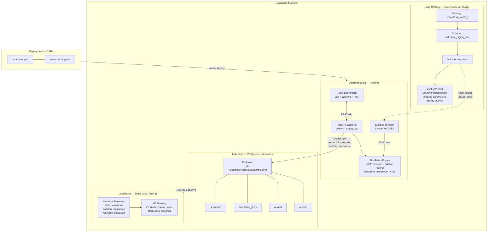
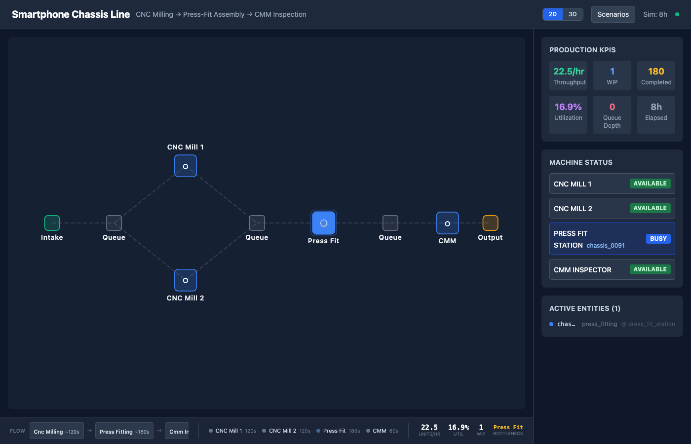
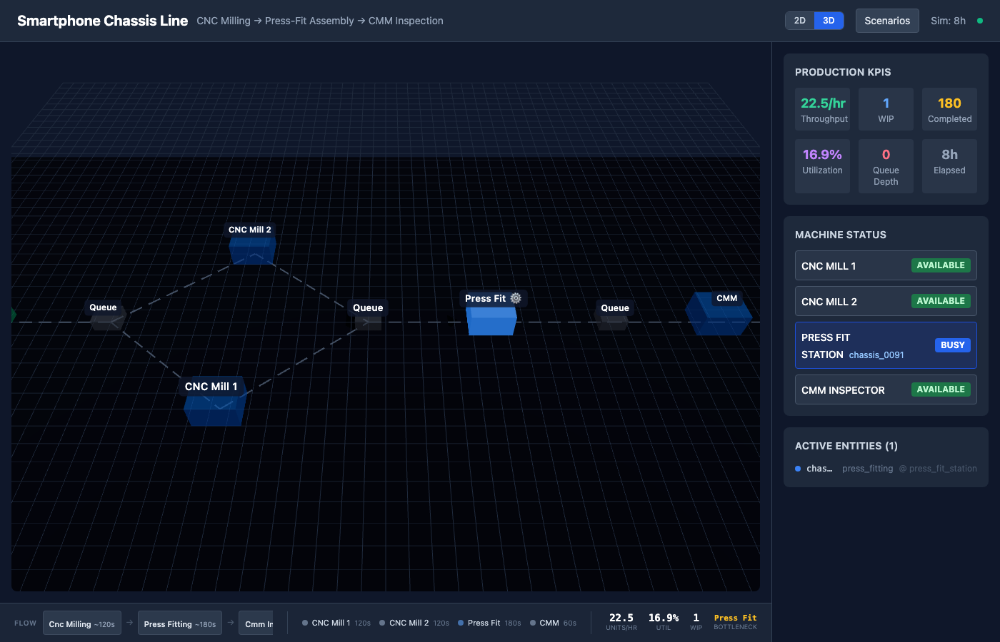
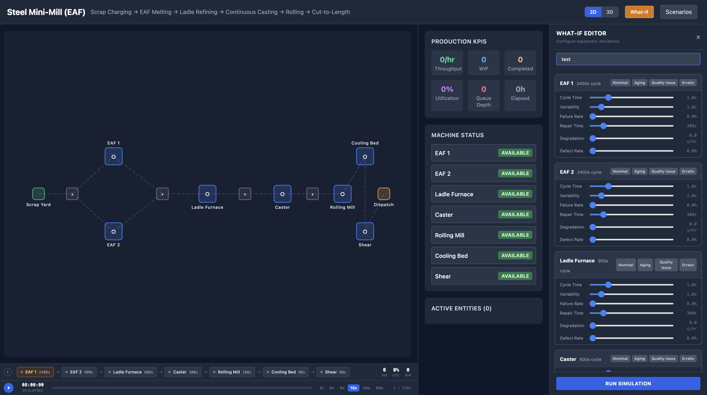
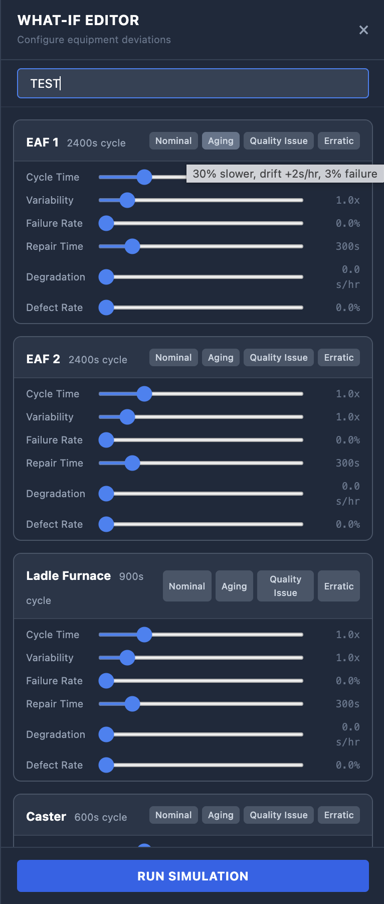

# Industrial Digital Twin

A configurable state-machine simulation engine that models any industrial plant or process line. Define your facility layout, machines, process steps, and scheduling in YAML — the engine handles entity spawning, routing, resource contention, and real-time KPI computation. A React dashboard visualizes the live simulation over WebSocket.

Designed for deployment as a **Databricks App** with **Lakebase** (PostgreSQL) for live simulation state and **Lakehouse** (Delta Lake) for historical telemetry, analytics, and ML model training.

---

## Architecture



### Data Flow Summary

| Flow | Source | Destination | Purpose |
|------|--------|-------------|---------|
| **Config ingest** | UC Volume (`raw_data/configs/`) | App bundle (`configs/`) | Equipment definitions, process params, facility layouts |
| **Simulation persist** | Engine (per scenario load) | Lakebase `simulation_ticks` | 5,761 frames per 8h sim at 5s intervals |
| **What-if persist** | User (via editor) | Lakebase `whatifs` | Saved deviation configurations |
| **Report persist** | Comparison engine | Lakebase `reports` | KPI comparison reports (baseline vs what-ifs) |
| **Scenario catalog** | App startup | Lakebase `scenarios` | All available configs with metadata |
| **Historical sync** | Lakebase | Delta Lake (future) | Long-term telemetry for ML training |

---

## Dashboard Views

The React dashboard provides two synchronized visualization modes, toggled via the header button:

### 2D Floor Plan (SVG)



Top-down schematic view with color-coded machines, conveyor paths, and animated entity dots. Shows queue depths, machine busy/idle state, and process flow at a glance.

### 3D Factory View (React Three Fiber)



Interactive 3D perspective with orbit camera controls (drag to rotate, scroll to zoom). Machines render as colored boxes with emissive glow when busy. Entities animate as spheres moving along conveyor paths. Labels float above each station.

Both views share the same data feed and stay perfectly in sync when switching.

### Playback Bar (Time Travel)

The simulation is **pre-computed on startup** — the entire run (default 8 hours of simulated time) is calculated server-side in seconds and delivered as a frame array to the frontend. This enables full time-travel capabilities:

| Control | Description |
|---------|-------------|
| **Play / Pause** | Start or stop automatic frame advancement |
| **Progress Bar** | Click anywhere to seek to any point in time — instant random access |
| **Speed Selector** | 1x, 2x, 5x, 10x, 30x, 60x playback speeds (1x = 1 sim-minute per real-second) |
| **Time Display** | Current simulation clock (HH:MM:SS) and elapsed hours |
| **Frame Counter** | Shows current frame / total frames for precise navigation |

The playback architecture:
- Backend pre-computes all frames at startup (`GET /api/simulation/frames`) with configurable snapshot interval (default: 5 sim-seconds between frames)
- Frontend loads the full frame set once, then plays through them locally — no network traffic during playback
- Seeking is instant (array index lookup) — scrub through an 8-hour simulation in milliseconds
- Switching scenarios triggers a full re-computation and reloads the frame set

---

### Engine Modules

| Module | Purpose |
|--------|---------|
| `src/engine/config.py` | Pydantic v2 models — full YAML schema validation |
| `src/engine/loader.py` | YAML parser with flattening and validation |
| `src/engine/engine.py` | Main tick loop, entity lifecycle, state transitions |
| `src/engine/models.py` | Core data classes: `EntityState`, `ResourceState`, `Position` |
| `src/engine/state_graph.py` | FSM executor + condition evaluator (and/or/threshold/duration) |
| `src/engine/spatial.py` | Dijkstra routing on facility graph + position interpolation |
| `src/engine/resource_manager.py` | Machine occupancy, queue management, utilization accounting |
| `src/engine/scheduler.py` | Poisson arrivals with shift-based rate modifiers |
| `src/engine/recorder.py` | Event collection: state transitions, position snapshots, events |

---

## How It Works

### Facility Model
A plant is defined as a 2D coordinate grid with **locations** (machines, buffers, spawn/exit points) connected by **directed paths** with distances. The spatial engine builds a graph and uses Dijkstra's algorithm to route entities between stations.

### State Machine
Each entity type references a **state graph** — a declarative finite state machine with:
- **States**: `queued` (waiting in buffer), `moving` (traversing path), `stationary` (being processed), `terminal` (complete)
- **Transitions**: condition-based rules evaluated per tick (resource availability, property thresholds, duration elapsed, boolean combinators)
- **Actions**: on-enter/on-exit hooks (acquire/release resources, emit events, set properties)

### Entity Lifecycle
```
Spawn (Poisson) → Route to first station → Wait/Process → Route to next → ... → Exit (destroy)
```

Entities carry typed properties (product variant, station index) that influence routing and transition conditions.

### Resource Contention
Machines have finite capacity. When busy, arriving entities queue in upstream buffers. The resource manager tracks per-machine busy time for utilization metrics.

---

## Bundled Scenarios

| Scenario | Config File | Process Flow | Stations | Rate |
|----------|-------------|--------------|----------|------|
| **Smartphone Chassis Line** | `assembly_line_3station.yaml` | CNC Milling → Press-Fit Assembly → CMM Inspection | 4 machines (2 parallel CNC) | 20/hr |
| **EV Battery Pack Assembly** | `ev_battery_pack.yaml` | Cell Stacking → Laser Welding → EOL Testing | 4 machines (2 parallel stackers) | 24/hr |
| **Steel Mini-Mill (EAF)** | `steel_mini_mill.yaml` | Scrap Charging → EAF Melting → Ladle Refining → Continuous Casting → Rolling → Cut-to-Length | 8 stations | 4/hr |
| **SMT Electronics Assembly** | `smt_electronics_assembly.yaml` | Solder Paste → Pick & Place → Reflow → AOI → Functional Test | 5 stations | 30/hr |
| **Beverage Bottling Line** | `beverage_bottling_line.yaml` | Rinse → Fill → Cap → Label → Case Pack | 5 stations | 120/hr |

Each scenario defines its own spatial layout, process durations, failure rates (MTBF), and shift schedules.

---

## What-If Scenarios

The What-If system allows interactive exploration of equipment deviations — model aging machines, quality issues, or erratic behavior and instantly see the impact on throughput, utilization, and queue depths.

### What-If Editor



The editor panel opens on the right side of the dashboard. Each machine gets its own card with deviation sliders and quick-apply presets.



Per-machine deviation sliders with preset buttons (Nominal, Aging, Quality Issue, Erratic). Modified parameters highlight in amber.

### How It Works

1. **Open the What-If Editor** via the header button
2. **Name your scenario** (e.g., "CNC Aging", "Worst Case")
3. **Adjust deviation sliders** per machine or apply presets (Nominal, Aging, Quality Issue, Erratic)
4. **Save** the configuration for later reuse, or **Load** a previously saved one
5. **Run Simulation** — the engine re-computes all frames with your deviations applied
6. **Review** — the header shows an amber badge with the scenario name, and a read-only parameter summary panel displays the active deviations alongside the running simulation

### Deviation Parameters

Each machine can be configured with the following deviation parameters that modify its nominal behavior:

| Parameter | Default | Range | Description |
|-----------|---------|-------|-------------|
| `cycle_time_factor` | 1.0 | 0.5–3.0 | Multiplier on base cycle time (1.3 = 30% slower) |
| `cycle_time_variability` | 1.0 | 0.5–5.0 | Multiplier on cycle time standard deviation |
| `failure_probability` | 0.0 | 0–0.2 | Probability of random breakdown after each processing cycle |
| `failure_duration_mean` | 300s | 60–1800s | Mean repair time when a breakdown occurs |
| `failure_duration_std` | 60s | — | Std deviation of repair time |
| `degradation_rate` | 0.0 | 0–10 | Seconds added to cycle time per simulated hour (drift) |
| `quality_defect_rate` | 0.0 | 0–0.3 | Probability of rework (entity re-processes instead of advancing) |

### Configuration in YAML

Deviations can be set as defaults in the scenario YAML under each machine's `deviations` block:

```yaml
locations:
  - id: cnc_mill_1
    type: machine
    label: "CNC Mill 1"
    position: { x: 30, y: 15 }
    capacity: 1
    properties:
      cycle_time_mean: 120
      cycle_time_std: 10
      mtbf_hours: 500
    deviations:
      cycle_time_factor: 1.0
      cycle_time_variability: 1.0
      failure_probability: 0.0
      failure_duration_mean: 300
      failure_duration_std: 60
      degradation_rate: 0.0
      quality_defect_rate: 0.0
```

The YAML `deviations` block defines the **nominal baseline**. The What-If Editor overrides these values at runtime without modifying the config file.

### Presets

| Preset | Effect |
|--------|--------|
| **Nominal** | All deviations reset to defaults — perfect machine behavior |
| **Aging** | 30% slower cycle time, +2s/hr degradation drift, 3% failure rate |
| **Quality Issue** | 10% defect/rework rate |
| **Erratic** | 3x variability in cycle time, 5% failure rate |

### Save / Load

What-if configurations are persisted as JSON files in `configs/whatif/{scenario_id}/`:

```json
{
  "name": "CNC Aging",
  "scenario_id": "assembly_line_3station",
  "overrides": {
    "cnc_mill_1": { "cycle_time_factor": 1.3, "degradation_rate": 2.0, "failure_probability": 0.03 }
  },
  "saved_at": "2026-05-16T21:49:45Z"
}
```

Only non-default values are stored. The Load button in the editor lists all saved what-ifs for the current scenario. Future versions will persist to Lakebase for team-wide sharing and batch execution.

---

## KPIs & Metrics

### Real-Time Dashboard Metrics

| Metric | Description | Unit |
|--------|-------------|------|
| `throughput_per_hour` | Completed products per simulated hour | units/hr |
| `wip_count` | Active entities currently in the system | count |
| `completed` | Total products that reached terminal state | count |
| `avg_utilization_pct` | Mean machine busy percentage across all stations | % |
| `total_queue_depth` | Sum of entities waiting across all buffers | count |
| `elapsed_hours` | Simulated time elapsed since start | hours |

### Per-Station Metrics

| Metric | Source | Description |
|--------|--------|-------------|
| Cycle Time | Config `cycle_time_mean` | Average processing duration per unit |
| MTBF | Config `mtbf_hours` | Mean time between failures |
| Utilization | `total_busy_time / elapsed_time` | Percentage of time the machine was occupied |
| Queue Depth | Resource manager | Current entities waiting for this station |
| Bottleneck | Derived (max cycle time) | Station limiting overall throughput |

### Historical Analytics (Lakehouse)

| Analysis | Data Source | Outcome |
|----------|-------------|---------|
| Throughput trends | State transitions → `done` | Production rate over time by shift/scenario |
| Cycle time distribution | Stationary state durations | Process stability and drift detection |
| Queue buildup patterns | Resource snapshots | Identify capacity constraints |
| Failure correlation | Event records (MTBF events) | Predictive maintenance scheduling |

---

## Databricks Platform Integration

### Unity Catalog — Governance & Assets

| Object | Path | Purpose |
|--------|------|---------|
| **Catalog** | `serverless_stable_3n0ihb_catalog` | Workspace catalog |
| **Schema** | `industrial_digital_twin` | Application schema |
| **Volume** | `raw_data` | Asset storage |
| **Volume files** | `raw_data/configs/*.yaml` | Equipment definitions, process parameters, facility layouts |

The UC Volume serves as the **design-time source of truth** for simulation configs. DABs syncs these to the app bundle at deploy time. At runtime, the app reads from its local `configs/` directory (since UC Volume FUSE is not available inside Databricks Apps).

### Lakebase (PostgreSQL) — Live State

Autoscale Lakebase project with OAuth M2M authentication:

```sql
-- Available simulation scenarios (populated on startup)
CREATE TABLE scenarios (
    id          TEXT PRIMARY KEY,
    name        TEXT NOT NULL,
    description TEXT DEFAULT '',
    config      JSONB,
    created_at  TIMESTAMPTZ DEFAULT NOW()
);

-- Full simulation frame data (5,761 frames per 8h sim)
CREATE TABLE simulation_ticks (
    id          SERIAL PRIMARY KEY,
    scenario_id TEXT NOT NULL,
    whatif_name TEXT,
    tick_index  INT NOT NULL,
    sim_time    REAL NOT NULL,
    data        JSONB NOT NULL,
    created_at  TIMESTAMPTZ DEFAULT NOW()
);

-- Saved what-if deviation configurations
CREATE TABLE whatifs (
    id          SERIAL PRIMARY KEY,
    scenario_id TEXT NOT NULL,
    slug        TEXT NOT NULL,
    name        TEXT NOT NULL,
    overrides   JSONB NOT NULL,
    created_at  TIMESTAMPTZ DEFAULT NOW()
);

-- KPI comparison reports (baseline vs what-ifs)
CREATE TABLE reports (
    id          SERIAL PRIMARY KEY,
    scenario_id TEXT NOT NULL,
    slug        TEXT NOT NULL,
    name        TEXT NOT NULL,
    report      JSONB NOT NULL,
    created_at  TIMESTAMPTZ DEFAULT NOW()
);
```

The app writes to Lakebase on every scenario load (full tick history) and on user actions (save what-if, save report). Query latency is 3-5ms.

### Lakehouse (Delta Lake) — Historical Telemetry (Future)

| Table | Partition | Content |
|-------|-----------|---------|
| `telemetry.position_snapshots` | `scenario / run_id / date` | Entity position + state every N seconds |
| `telemetry.state_transitions` | `scenario / run_id / date` | Every state change with timestamps |
| `telemetry.events` | `scenario / run_id / event_type` | Machine events (start, complete, failure) |
| `telemetry.resource_utilization` | `scenario / run_id / date` | Per-machine busy/idle time series |

Data flows from Lakebase → Delta via **reverse ETL sync** (Databricks Lakebase Sync).

### ML & Model Training (Future)

| Use Case | Features | Target | Approach |
|----------|----------|--------|----------|
| **Bottleneck Prediction** | Queue depths, utilization rates, entity counts | Which station will block next | Classification (XGBoost) |
| **Predictive Maintenance** | Cumulative busy time, cycle count, MTBF history | Time to next failure | Survival analysis |
| **Cycle Time Optimization** | Product variant, shift, temperature proxy | Optimal process parameters | Bayesian optimization |
| **Anomaly Detection** | Rolling throughput, queue variance | Operational anomalies | Isolation Forest |

All models registered in **MLflow**, features served via **Feature Store**, inference endpoints via **Model Serving**.

---

## Developer Guide

### Prerequisites

- Python >= 3.10
- Node.js >= 18
- [uv](https://docs.astral.sh/uv/) package manager

### Installation

```bash
# Clone and install Python dependencies
cd databricks_industrial_digital_twin
uv sync

# Install frontend dependencies
cd app/frontend
npm install
cd ../..
```

### Local Development

```bash
# One command — starts backend (:8000) + frontend (:3000)
./dev.sh
```

Or manually:

```bash
# Terminal 1 — Backend (auto-reload on code changes)
uv run uvicorn app.backend.main:app --reload --host 0.0.0.0 --port 8000

# Terminal 2 — Frontend (Vite dev server with HMR)
cd app/frontend && npm run dev
```

Open http://localhost:3000 — the Vite dev server proxies `/api` and `/ws` to the backend.

### Running Tests

```bash
uv run pytest tests/
```

23 tests covering: engine lifecycle, config loading, spatial routing, state graph evaluation.

### Building for Production

```bash
cd app/frontend && npm run build
```

Static assets are output to `app/frontend/dist/`. The FastAPI backend serves them automatically when the `dist/` directory exists.

### Environment Variables

| Variable | Default | Description |
|----------|---------|-------------|
| `SIM_CONFIG` | `assembly_line_3station` | Default scenario to load on startup |
| `SIM_CONFIGS_DIR` | `configs` | Directory containing YAML scenario files |
| `SIM_SPEED` | `60` | Simulation speed multiplier (60 = 1 sim-minute per real-second) |

---

## Databricks App Deployment (DABs)

This application is deployed via **Databricks Asset Bundles** (DABs) for reproducible, version-controlled deployments.

### Bundle Structure

```
databricks.yml          # Bundle config: sync rules, variables, targets
resources/app.yml       # App resource: env vars, description
app.yaml                # Runtime command: python startup.py
startup.py              # Entry point with error handling
```

### Quick Deploy

```bash
# 1. Build frontend
cd app/frontend && npm run build && cd ../..

# 2. Validate bundle
databricks bundle validate -t dev

# 3. Deploy (syncs files + creates/updates app)
databricks bundle deploy -t dev

# 4. Run (triggers new deployment)
databricks bundle run industrial_digital_twin -t dev
```

### Post-Deploy: Grant Lakebase Access

The app's service principal needs OAuth access to the Lakebase endpoint:

```bash
# Add sql scope
databricks apps update industrial-digital-twin-dev --json '{"user_api_scopes": ["sql"]}'

# Create Lakebase OAuth role (Python SDK)
from databricks.sdk import WorkspaceClient
from databricks.sdk.service.postgres import *

w = WorkspaceClient(profile='FEVM_SERVERLESS_STABLE')
SP_ID = "<service_principal_client_id>"  # from: databricks apps get <name> | jq .service_principal_client_id

w.postgres.create_role(
    parent='projects/industrial-digital-twin/branches/production',
    role=Role(spec=RoleRoleSpec(
        auth_method=RoleAuthMethod.LAKEBASE_OAUTH_V1,
        identity_type=RoleIdentityType.SERVICE_PRINCIPAL,
        membership_roles=[RoleMembershipRole.DATABRICKS_SUPERUSER],
        postgres_role=SP_ID,
    )),
    role_id=f'sp-{SP_ID[:8]}',
)
```

See [`docs/DEPLOYMENT.md`](docs/DEPLOYMENT.md) for the complete step-by-step guide including Lakebase project setup, table creation, and troubleshooting.

### Environment Variables (managed by DABs)

| Variable | Value | Description |
|----------|-------|-------------|
| `LAKEBASE_HOST` | `ep-*.database.*.cloud.databricks.com` | Lakebase endpoint hostname |
| `LAKEBASE_PORT` | `5432` | PostgreSQL port |
| `LAKEBASE_DATABASE` | `databricks_postgres` | Database name |
| `LAKEBASE_SCHEMA` | `public` | Schema for tables |
| `LAKEBASE_ENDPOINT_NAME` | `projects/.../endpoints/primary` | Full endpoint resource name for OAuth |
| `LAKEBASE_USE_OAUTH` | `true` | Enable M2M OAuth credential flow |
| `SIM_CONFIGS_DIR` | `configs` | Bundled config path (not Volume — FUSE unavailable in Apps) |

### Monitoring

```bash
# App status
databricks apps get industrial-digital-twin-dev --profile FEVM_SERVERLESS_STABLE

# Live logs
databricks apps logs industrial-digital-twin-dev --profile FEVM_SERVERLESS_STABLE

# Health check (with auth)
TOKEN=$(databricks auth token --profile FEVM_SERVERLESS_STABLE | jq -r '.access_token')
curl -H "Authorization: Bearer $TOKEN" https://<app-url>/health
```

---

## Creating Custom Scenarios

Create a new YAML file in `configs/`:

```yaml
simulation:
  name: "My Custom Plant"
  description: "Step A → Step B → Step C"
  duration_hours: 8
  time_step_seconds: 1
  seed: 42

facility:
  name: "Plant Name"
  coordinate_system: cartesian_2d
  bounds: { width: 100, height: 50, unit: meters }

  locations:
    - id: intake
      type: spawn_point
      label: "Intake"
      position: { x: 10, y: 25 }

    - id: machine_1
      type: machine
      label: "Machine 1"
      position: { x: 50, y: 25 }
      capacity: 1
      properties: { cycle_time_mean: 120, mtbf_hours: 500 }

    - id: output
      type: exit_point
      label: "Output"
      position: { x: 90, y: 25 }

  paths:
    - from: intake
      to: machine_1
      distance: 40
    - from: machine_1
      to: output
      distance: 40

state_graphs:
  product_flow:
    states:
      waiting:
        type: queued
        queue_discipline: FIFO
      in_transit:
        type: moving
        speed:
          distribution: constant
          params: { value: 1.5 }
      processing:
        type: stationary
        duration:
          distribution: normal
          params: { mean: 120, std: 15 }
        on_enter:
          - action: acquire_resource
            resource_type: machine
        on_exit:
          - action: release_resource
            resource_type: machine
      done:
        type: terminal
        on_enter:
          - action: destroy_entity

    transitions:
      - from: in_transit
        to: processing
        condition:
          type: arrived_at_destination
        priority: 1
      - from: processing
        to: in_transit
        condition:
          type: duration_elapsed
        priority: 1
        next_location: { type: next_in_sequence }

entity_types:
  product:
    state_graph: product_flow
    initial_state: waiting
    spawn_rule: schedule

schedule:
  type: poisson
  rate_per_hour: 20
```

The scenario appears automatically in the dashboard's scenario picker.

---

## API Reference

| Method | Endpoint | Description |
|--------|----------|-------------|
| `GET` | `/api/scenarios` | List available scenario configs with active flag |
| `POST` | `/api/scenarios/load` | Switch active scenario, re-computes all frames `{"id": "config_name"}` |
| `POST` | `/api/scenarios/simulate` | Run what-if simulation with overrides `{"id": "...", "name": "...", "overrides": {...}}` |
| `GET` | `/api/scenarios/{id}/parameters` | Get machine locations with deviation parameters for a scenario |
| `GET` | `/api/simulation/frames` | Full pre-computed frame array (config, paths, locations, state descriptions, all frames, whatif_name, whatif_overrides) |
| `POST` | `/api/whatif/save` | Save a what-if configuration `{"scenario_id": "...", "name": "...", "overrides": {...}}` |
| `GET` | `/api/whatif/list/{scenario_id}` | List saved what-if configs for a scenario |
| `GET` | `/api/whatif/load/{scenario_id}/{filename}` | Load a saved what-if configuration |
| `GET` | `/api/status` | Simulation runtime status, frame count, elapsed time |

### Frames Endpoint (Playback)

`GET /api/simulation/frames` returns the full simulation as a seekable frame array:

```json
{
  "config": {"name": "...", "description": "...", "facility_name": "..."},
  "paths": [{"from": {"x": 5, "y": 25}, "to": {"x": 18, "y": 25}}, ...],
  "locations": [{"id": "cnc_mill_1", "type": "machine", "label": "CNC Mill 1", ...}, ...],
  "state_descriptions": {"cnc_milling": {"description": "...", "type": "stationary", "duration": {"mean": 120, "std": 10}}, ...},
  "frames": [
    {"sim_time": "2025-01-01T06:00:00", "elapsed_s": 0, "entities": [...], "resources": [...], "metrics": {...}},
    {"sim_time": "2025-01-01T06:00:05", "elapsed_s": 5, ...},
    ...
  ],
  "frame_count": 5760,
  "snapshot_interval_s": 5
}

---

## License

MIT
